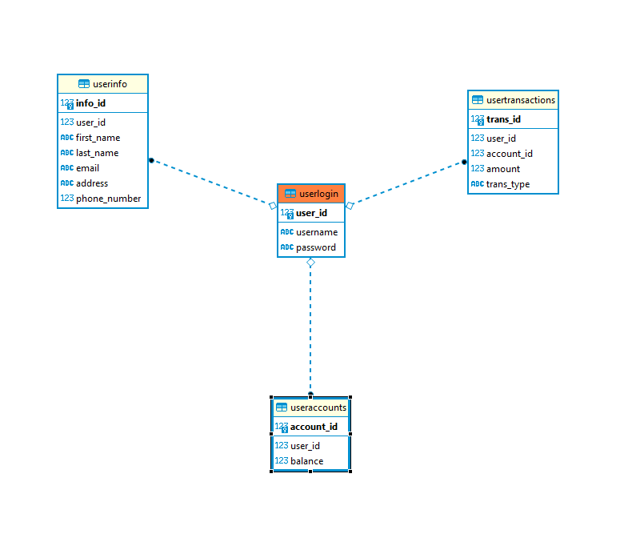

# Project0

This is the repository for SimpleBanking; a project utilized  to develop a simple fullstack developed in flask and html utilizing restapi's, aws database connectivity and a testing suite.
The web app I have built is a simple banking app that provides several functionalities to the user: 1) Register an account with a unique username and password 2) Login with that username 3)Set up a user profile
4)Create a banking account 5)Make transactions to deposit or withdraw their money 6) A page to display a list of their transactions 7) A way to close their bank account and 8)A way to close user accounts permanently.

The trello story board is here: https://trello.com/b/hXmBWHIc/project-0

Technology stack
----------------------

Python3
HTML/CSS
Flask
AWS RDS
PYTEST
POSTMAN

Database ERD
---------------

